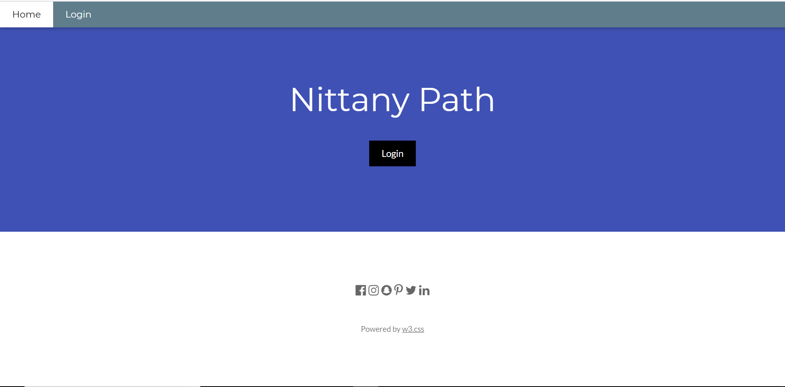
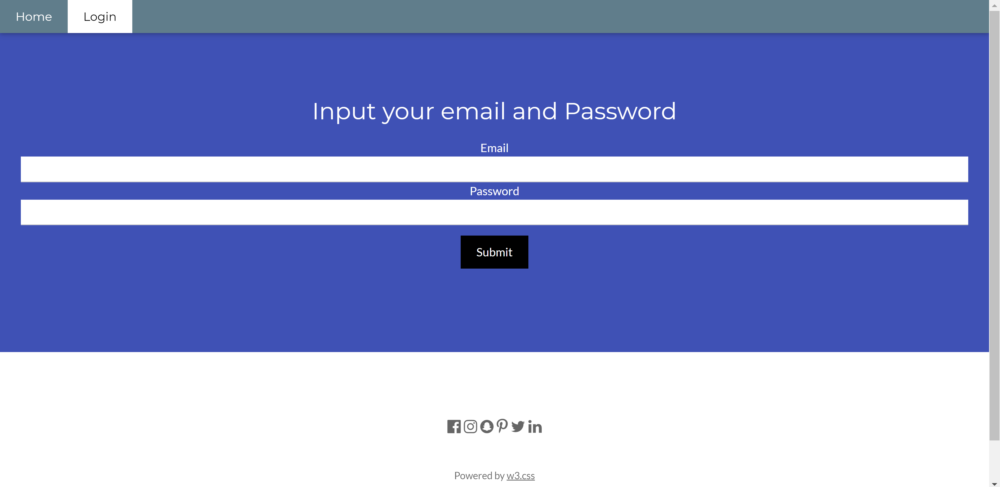
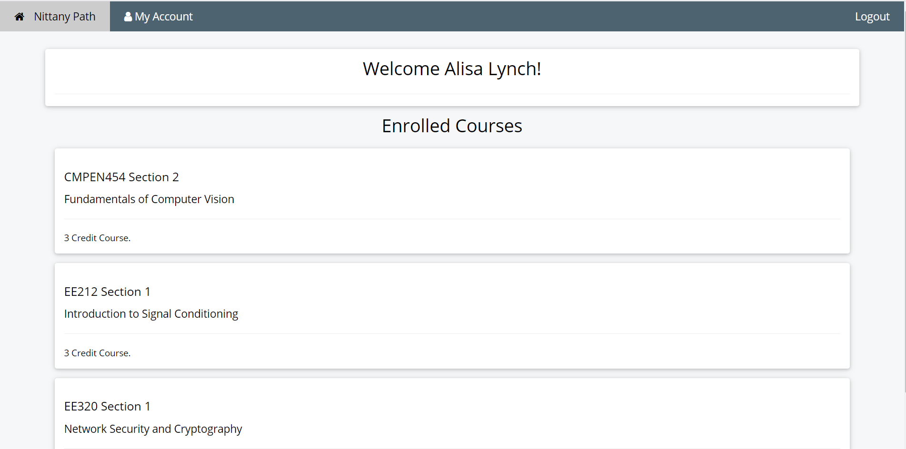
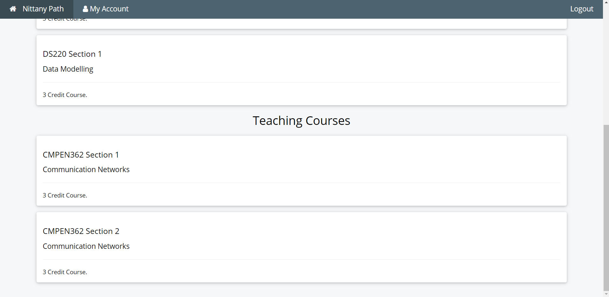
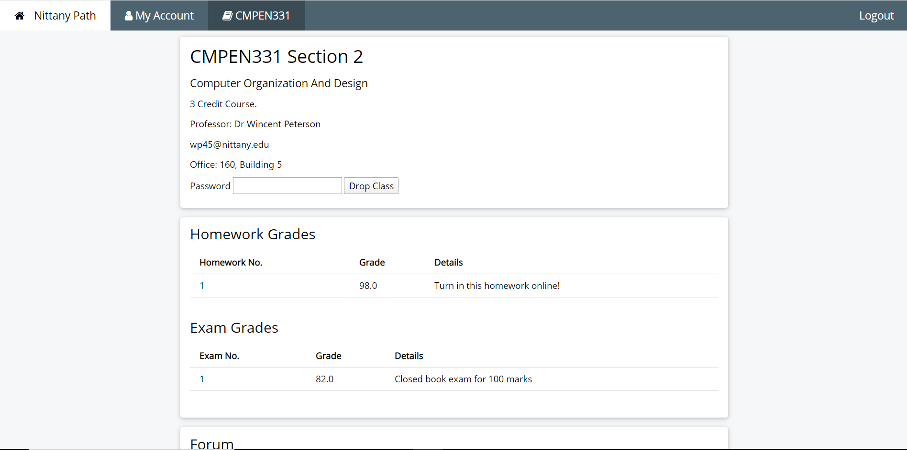
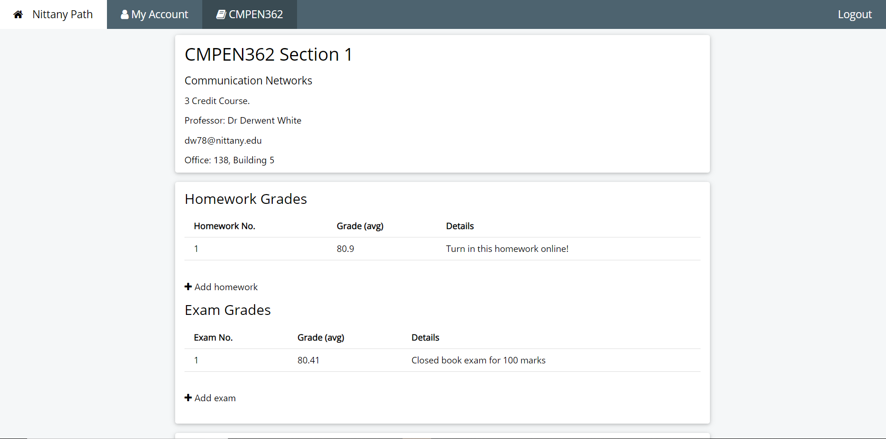
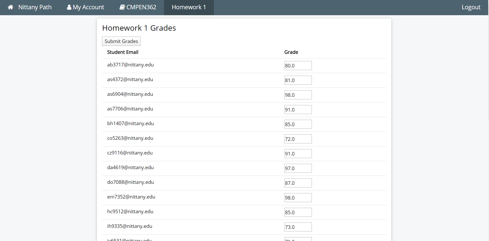
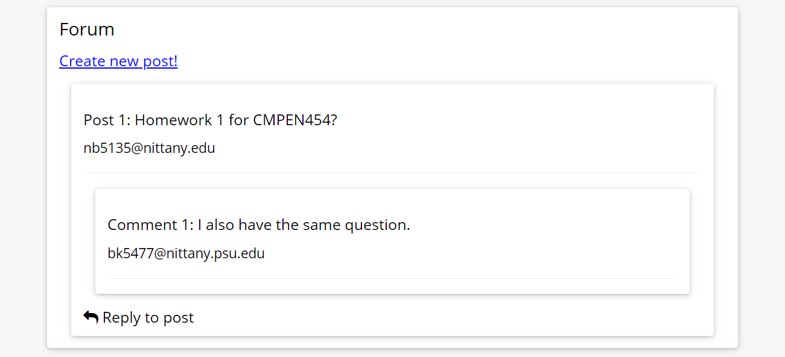

# Nittany Path - Bowen Yao

Nittany Path is a Canvas-esque website powered by Jetty and MySQL. With it users can view enrolled classes, profile information, and drop classes, and teachers and ta's can create assignments and assign grades

## Database

#### Database Initialization

Nittany Path is backed by a database in MySQL. The database is programmatically accessed using JDBC. In the `DBFunctions` class there are several functions which are used to read data from csv files and upload them to the database. There's a lot of code there so I won't go into details but `DBFunctions.cleanInstall()` drops all the tables and uploads the data anew from the given dataset. Running the main function simply does a clean install.

`DBFunctions.clearTables()` drops the tables in order and then repeatedly goes back to drop any tables that could not be dropped do to enforced constraints until either there are no tables left or the tables have not changed for three iterations. I am not sure if it is possible for this function to fail at clearing the tables so that is a future thing to work on.

Notice that email is only 6 characters. This is because I store emails as just the part before the @nittany.edu to save on space and make parsing a bit simpler in my opinion.

#### Database Functions

`DBFunctions` also contains several functions used for database queries and updating that are used throughout the rest of the application. They are for the most part self-explanatory.

## Landing Page

The landing page is straightforward. It is taken from a template online and modified slightly. There are only three active elements to the page. The two buttons on the navigation bar at the top and the login button in the middle of the screen. The login buttons navigate the user to the login page while clicking the home button simply refreshes the landing page.

## Login Page

The login page is also very simple at  the moment. It is the same template modified now to have a form. The two buttons in the navigation bar continue to serve the same purpose while inputting an email and password and then pressing the submit button sends a POST request to the backend servlet. Currently users can input their email with or without the @nittany.edu

#### User Authentication

NittanyPath uses a form of user authentication that I came up with myself rather than Jetty's user authentication. Upon submitting the form the server accesses the database `NittanyServer.login()`, passing user email and the hashed password. If the login fails the user is redirected to this page and a failure alert appears. If the login succeeds the user's current session id which is browser affiliated and unique for the most part is stored in a `HashMap<String,NittanyUser>` with the session id as the key and with one of my own objects `NittanyStudent`or `NittanyProfessor` which extend `NittanyUser` as the value based off of what the user is. The user object is a collection of user info necessary to construct the home page of the NittanyPath. In this way my authentication kills two birds with one stone. Every time a request is processed on a page which is user locked the server checks to see if the current session is stored in the HashMap using `NittanyServer.authenticate(String sessionId)`. This also allows me to verify what *kind* of user is accessing the page as I can cast the user as either a student or professor to test if they have the correct permissions. If at any point a user does not have the correct permissions or is not authenticated they are either sent back to a safe page like the home page which is loaded the same for all users or they are booted to the login page. This process is also highly expandable in case I want to add new types of users like perhaps an administrator in the future.

##### Logout Process

As an aside the logout process boots the current user to the login page while removing the session id from hashmap.

## Home Page

The home page is procedurally generated from a default page tailored to each specific user. Courses are split into enrolled courses and teaching courses as shown above although most students only have enrolled courses and teachers only have teaching courses so usually only one is shown. Each course is clickable and will send a Get request to the link "/course?COURSEID" where the COURSEID is the course ID of the course clicked. Unfortunately this means it doesn't quite work for teaching courses which often have overlapping course Ids but that is an easy fix.

## Course Page

Similar to the home page the course page is also procedurally generated. Currently the server checks the users courses based on courseid  to determine which course should be loaded and as mentioned before that causes a slight error for taught courses.

Students have a drop course whereas teachers can add assignments and can click on the assignment number to edit courses.

When a teacher clicks on an assignment or exam they are taken to a list of the grades for that assignment. They are free to change the fields in the grades and submitting it will change the grades accordingly.

### Forum

The forum is also procedurally generated. Each post is generated from a default html file with all its comments inside similarly generated. Users of all types can access the forum and make comments so it is identical for each course page. Creating a new post or replying to an existing post will refresh the page so it can be seen.

### Other notes 

There are a lot of areas for possible improvement. Improvements can be made aesthetically as well as to make the experience more user friendly and intuitive. Possible future features including class enrollment in the like can also be considered. On the code side of things more comments and cleaner code might be useful to improve readability and make adding future features easier.
